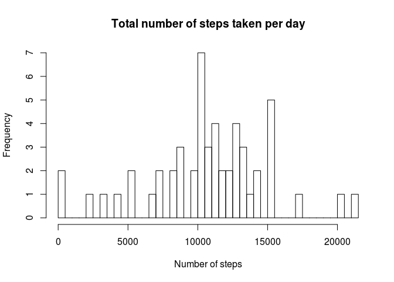
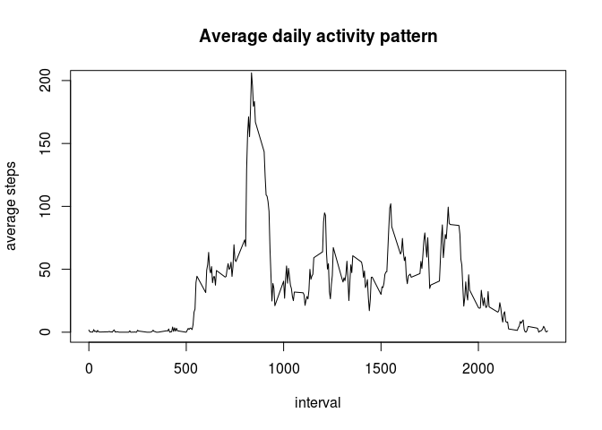
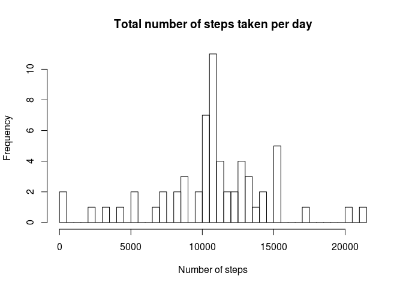
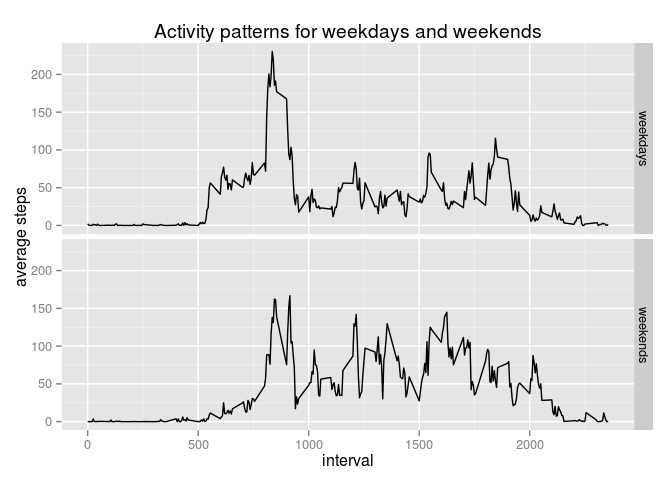

# Reproducible Research: Peer Assessment 1


## Loading and preprocessing the data

First part of our analysys - we should read and process the data.  
Here we read the *.csv* file and parse date whith *ymd()* function.  


```r
fresh <- read.csv("activity.csv")
library(lubridate)
fresh[,2] <- ymd(as.character(fresh[,2]))
```

## What is mean total number of steps taken per day?

For our next step we should create a new data set, a copy of the *fresh* data set read from the file with no NAs in it.  
Than, using *dplyr* package from R, we separate the data in groups by date and count the sum of steps taken per each day.  


```r
data <- fresh[!is.na(fresh[,1]),]
library(dplyr)
```

```
## 
## Attaching package: 'dplyr'
## 
## The following objects are masked from 'package:lubridate':
## 
##     intersect, setdiff, union
## 
## The following object is masked from 'package:stats':
## 
##     filter
## 
## The following objects are masked from 'package:base':
## 
##     intersect, setdiff, setequal, union
```

```r
mt <- summarise(group_by(data, date), sum(steps))
names(mt) <- c("date", "ss")
hist(mt$ss, breaks=50, main="Total number of steps taken per day", xlab="Number of steps")
```

 

```r
mean <- mean(mt$ss)
median <- median(mt$ss)
```

So we recive a histogram. Also we count the **mean** and the **median** of number of steps, which are 1.0766189\times 10^{4} and 10765 respectivly.

## What is the average daily activity pattern?

Here we again use the *data* set, which was copied a few rows above. We separate the data in groups by intervals and calculate the mean of steps per each interval.


```r
ad <- summarise(group_by(data, interval), mean(steps))

names(ad) <- c("interval", "ms")
plot(ad$interval, ad$ms, type="l", main= "Average daily activity pattern", xlab="interval", ylab="average steps", ylim=c(0,200))
```

 

```r
maxad <- ad[ad$ms==max(ad[,2]),]
maxint = as.numeric(maxad[,1])
maxstep = as.numeric(maxad[,2])
```

Also we create a plot with the intervals on x-axis and the mean of steps on y-axis. The 5-minute interval, on average across all the days in the dataset, which contains the maximum number of steps is 835 whith 206.1698113 steps in average in it.

## Imputing missing values

For this part we will copy the *fresh* data set again, to be able to make any changes in it.


```r
data2 <- fresh
NAs <- sum(is.na(data2[,1]))
```

As far as we see there are 2304 NA values in this data set.  

So now we proceed the data set, adding new values instead of NAs. They are the mean for this interval across all days.


```r
for(i in 1:17568){
    if(is.na(data2[i ,1])){
    int <- data2[i, 3]
    data2[i, 1] <- mean(data[data$interval==int, 1], na.rm=T)
    }
}
```

Than we separate the data in groups by date and count the sum of steps taken per each day. And create a histogram.


```r
mt2 <- summarise(group_by(data2, date), sum(steps))
names(mt2) <- c("date", "ss")
hist(mt2$ss, breaks=50, main="Total number of steps taken per day", xlab="Number of steps")
```

 

```r
mean2 <- mean(mt2$ss)
median2 <- median(mt2$ss)
dmean <- mean2-mean
dmedian <- median2-median
```

We've also calculated new *mean* and *median* of total number of steps taken per day. They are 1.0766189\times 10^{4} and 1.0766189\times 10^{4} respectivly. Which is nearly the same as in the first part of our analysys - there it was 1.0766189\times 10^{4} for *mean* and 10765 for median. So we recive the differ between two datasets as 0 for *means* and 1.1886792 *medians*.

## Are there differences in activity patterns between weekdays and weekends?

For this part we, first of all, parse date from the *data2* data set as a number of weekday to a new vector.


```r
numday <- wday(data2[,2])
```

Than we create a new factor variable *weekdends* and assign to it "weekdays" for days number 2 to 6 and "weekends" for days number 1 and 7. Than we bind this new factor variable with our data set *data2*


```r
weekdends <- factor(levels=c("weekdays", "weekends"))
for(i in 1:17568){
    if(numday[i] %in% 2:6){
    weekdends[i] <- "weekdays"
    }
    else weekdends[i] <- "weekends"
}

data3 <- cbind(data2, weekdends)
```

For the next step we separate the data in groups by wekdends and intervals and count the mean of steps taken per each interval on weekdays and weekends separately. And also constructs a panel plot.


```r
aw <- summarise(group_by(data3, weekdends, interval), mean(steps))

names(aw) <- c("wd", "interval", "ms")

library(ggplot2)
qplot(x=interval, y=ms, data=aw, facets=wd~., geom="line") + 
    ggtitle("Activity patterns for weekdays and weekends") +
    ylab("average steps") + xlab("interval")
```

 
